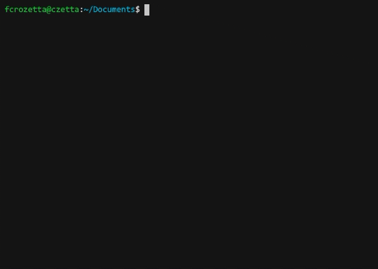
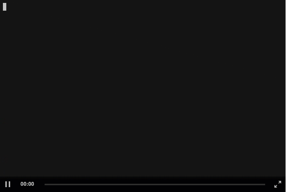
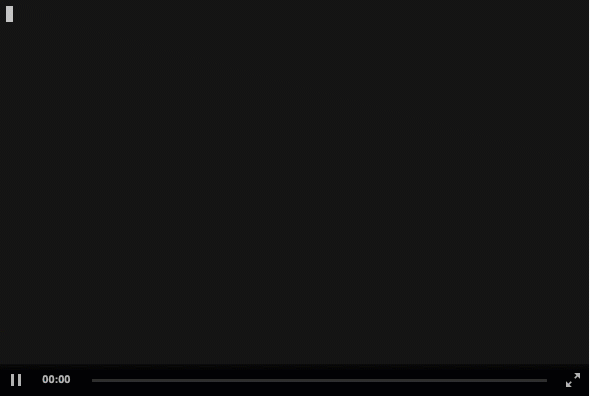
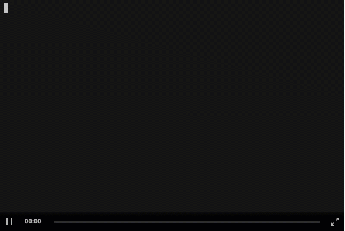
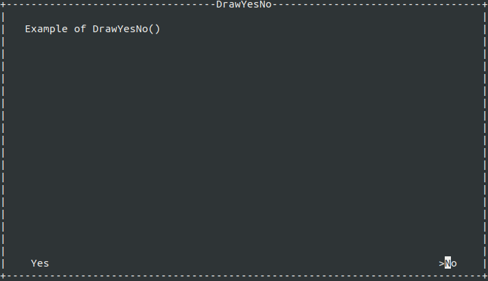
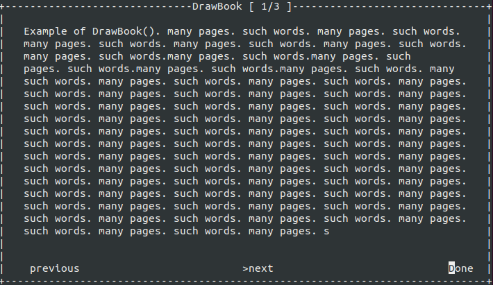

[](https://ko-fi.com/L3L01VSK2)


# tui-netcore
Simple Text User Interface for .net Core.
This Class was implemented to make easy to implement a simple interface for the user.
It's is possible to use, but bugs are still happening.

> Nuget Package was released Firstly as Stable package. That was not the intention.

>0.0.1 and 0.0.1-alpha are the same.

# Contents
- [tui-netcore](#tui-netcore)
- [Contents](#contents)
- [But why?](#but-why)
- [Instalation](#instalation)
- [Usage](#usage)
  - [Creating a Hello World](#creating-a-hello-world)
  - [Instantiating the box object](#instantiating-the-box-object)
  - [OK Box](#ok-box)
  - [Drawing a box, without waiting response from user](#drawing-a-box-without-waiting-response-from-user)
  - [Drawing an Input Box](#drawing-an-input-box)
  - [Drawing a Yes/No Box](#drawing-a-yesno-box)
  - [Draw a check Box](#draw-a-check-box)
  - [Draw a list box](#draw-a-list-box)
  - [Draw a Book box](#draw-a-book-box)
- [Bugs](#bugs)

# But why?
>tl,dr; Because why not?

I've used other TUI programs in python, bash and node, but personally i didn't enjoy all the parameters i had to pass to render a simple message in the screen. So, i created one class, that draws a box, and the same box can be rendered as:
- Simple message box (pressing any key will continue)
- User Input box (User can type the answer and press <kbd>enter</kbd> to confirm)
- Yes/No box (User can select with Arrow keys, and <kbd>enter</kbd> to confirm)
- Check Box (User can select multiple elements with arrow keys and <kbd>spacebar</kbd>, and <kbd>enter</kbd> to confirm)
- List Box (User can choose one option in the list, and press <kbd>enter</kbd> to select the option)


# Instalation

> If you don't have dotnet core installed, you can follow the instructions on this website : https://www.microsoft.com/net/download/windows

If you have your own project and want to use this interface, you just have to install the package. The easiest way to do it is:
1. open a terminal and go to your project folder
2. Execute command:
    `dotnet add package fc.tui-core`
3. Execute the command:
    `dotnet restore`

> If you need other ways to install the package, you can check https://www.nuget.org/packages/fc.tui-core/

# Usage
To use the class, it's possible to initialize only one time use the same windows multiple times. In this section we will initialize once and use it for every example.

## Creating a Hello World



The easiest way to start is creating a window that uses all the available space in your terminal.

In your project, add the import
```csharp
using tui_netcore;
```

and inside your program, create a new window:

```csharp
Tui window = new Tui()
window.Title = " Hello World ";
window.Body = "This is a dullscreen window";
window.DrawOk();
```

and run it with ```dotnet run``` or the method you prefer.
## Instantiating the box object

```csharp
using tui_netcore;

/* Inside your main */
Tui t= new Tui();
```

If you want to use directly, you can also use the following code:
```csharp
using tui_netcore;

/* Inside your main */
Tui.ColorSchema schema =Tui.ColorSchema.Info; // This is used to change the color of the box
Tui t = new Tui(){
    Title = "Title message",
    Body = "Body message"
};
```

## OK Box


```csharp
t.DrawOk();
```
Yes. It's simple like that.

DrawOk() Method will accept any key to continue.


## Drawing a box, without waiting response from user
```csharp
    t.Draw();
```
This will create a box, and continue the program. Use this as a part of something more complex.

## Drawing an Input Box


```csharp
string answer = t.DrawInput();
```

The return type of the DrawInput Method will always be a string.
Note that the Property AnserChar will be printed where the User have to type

## Drawing a Yes/No Box


```csharp
bool answer = t.DrawYesNo();
```

The Yes/no box returns a bool, where "yes" is true.


You can customise the "yes" and "no" words, like this:
```csharp
bool answer = t.DrawYesNo(schema,txtYes="YAH",txtNo="NAH");
```
You can also set the default option, adding an argument at the end of the method:
```csharp
// This set the default answer to YES (true)
bool answer = t.DrawYesNo(schema,txtYes="YAH",txtNo="NAH",defaultAnswer=true);
```
## Draw a check Box
[](https://asciinema.org/a/CXProc6Etf4UuPR6s7aQKnutp)
This type of box will allow the user to select multiple options with spacebar, and continue with Enter
The signature of the method is:
```csharp
public List<CheckBoxOption> DrawCheckBox(List<CheckBoxOption> options, ColorSchema schema = ColorSchema.Regular, bool onlyChecked = true)
```
The first parameter is a list of checkboxOption objects, followed by a ColoSchema, and a boolean as last parameter.
You can check the CheckBox class on TUI.cs file.
The schema is also set on TUI.cs file, and is used to change the colors of the boxes.
The last parameter is used to return only the options selected by the user(true), or the entire list, with checked and unchecked values.

>Note that the return type is a list of CheckBoxOption

## Draw a list box
[](https://asciinema.org/a/z3qETOmPLjxLabSp1hALvREbo)


This type of box will render a List of otions where the user can select only one option. This box can be used as simple selction and menu.

>For now there is no description. If you want to show the description, you have to format manually the strings.
```csharp
string ListBox = t.DrawList(new List<string>() {
                "Banana",
                "Apple",
                "Orange"
        });
```
## Draw a Book box
[](https://asciinema.org/a/uaBmZK6X3nS8tovaTUbDCrHi3)


This type of box will render a "book" splitting the text into pages.

The page number will be at the title bar, after the title

```csharp
string ListBox = t.DrawBook();
```

# Bugs
Yes.
